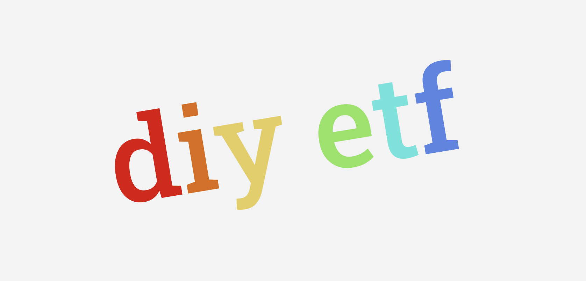

<h1 align="center">diy etf</h1>

A program you can create ETFs and buy and redeem ETF shares with.

## Use cases

- buy an ETF to easily get exposure to many assets e.g. the top 10 crypto
- use an ETF as collateral on a lending platform
- build ETFs of ETFs 🤔?
- more cool stuff?

## Basic flow

This flow is not live yet, currently on devnet when buying an etf share, the token parts are minted out of thin air for the user. No trading via serum takes place.

1. user A creates etf
2. user X buys a share of the etf with a token which is sold for the separate ETF parts by the program e.g. on Serum, program locks parts in vaults and mints ETF share token to user
3. user X may redeem a share and receive either the underlying assets or have the program convert the ETF parts to a token of their choice
